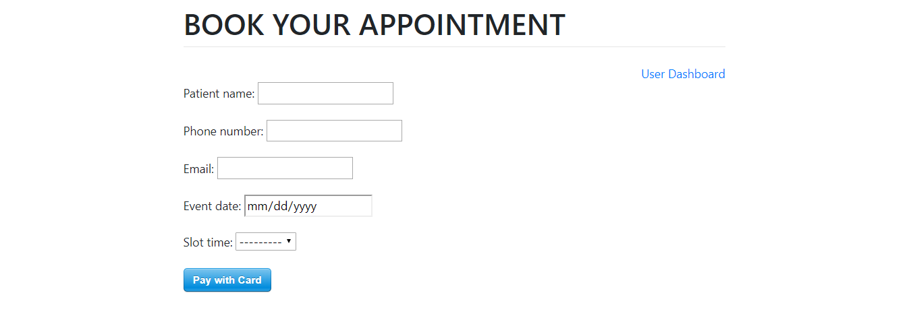
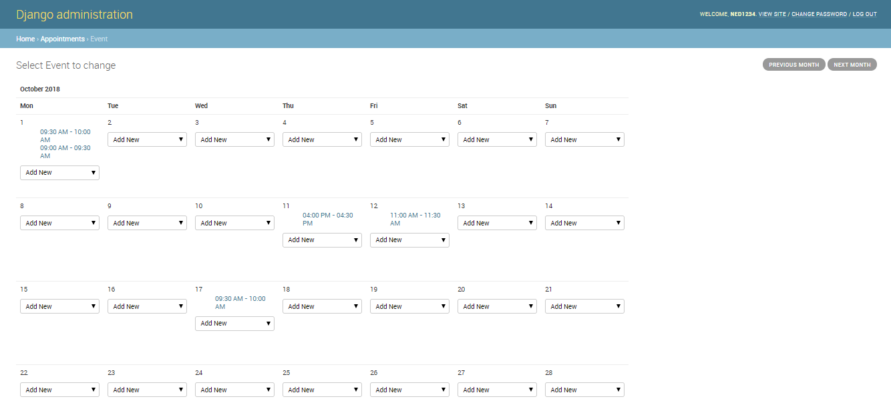
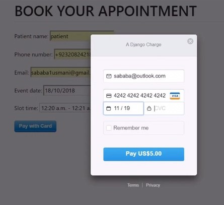
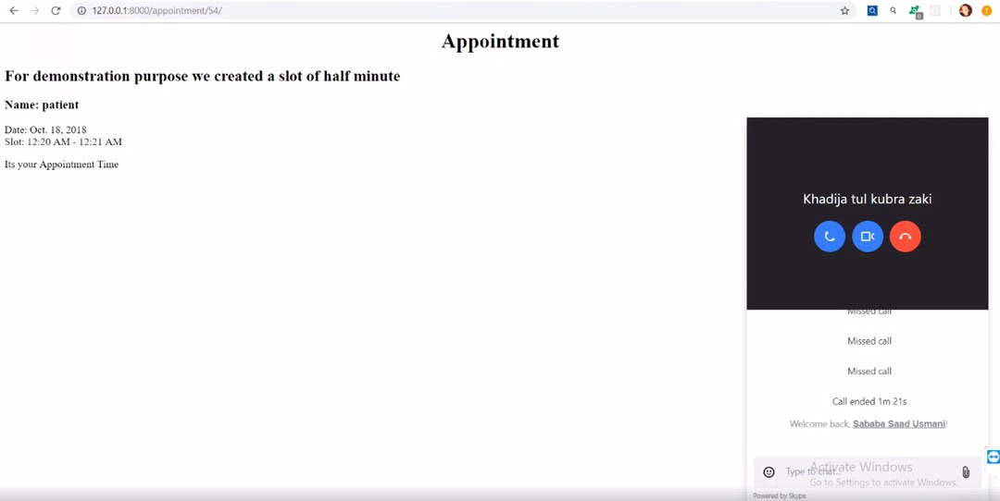

# AppointmentScheduler
A Django based web app to schedule appointments for the doctor. The web app uses stripe as payment method and Skype interviews are held between doctor and patient.
 

<h1>Patient View:</h1>

<h1>Admin View:</h1>

<h1>Stripe Payment View:</h1>

<h1>Skype View:</h1>

